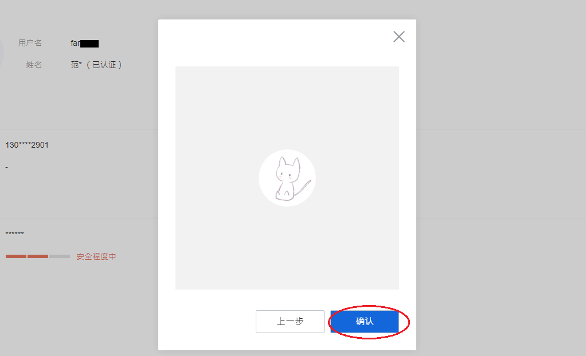
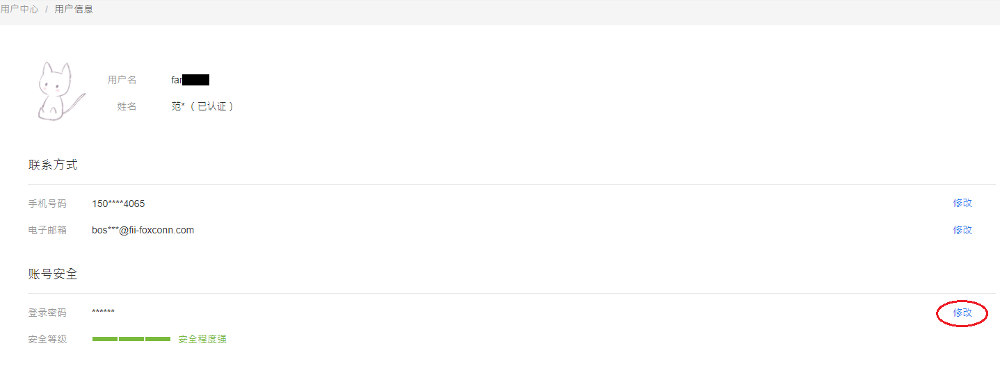
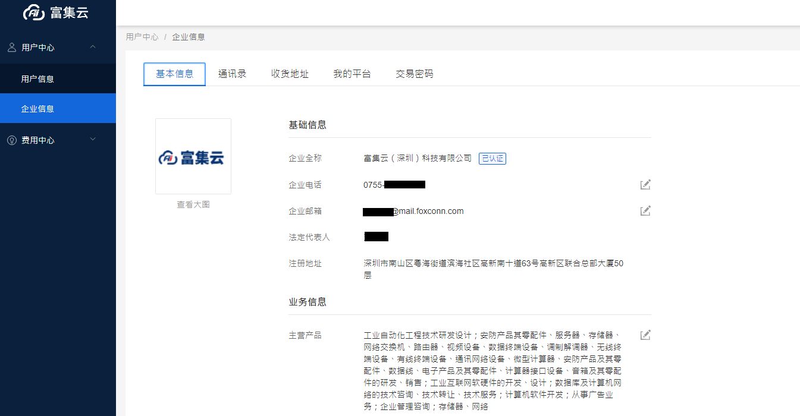
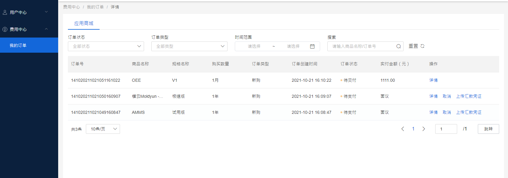
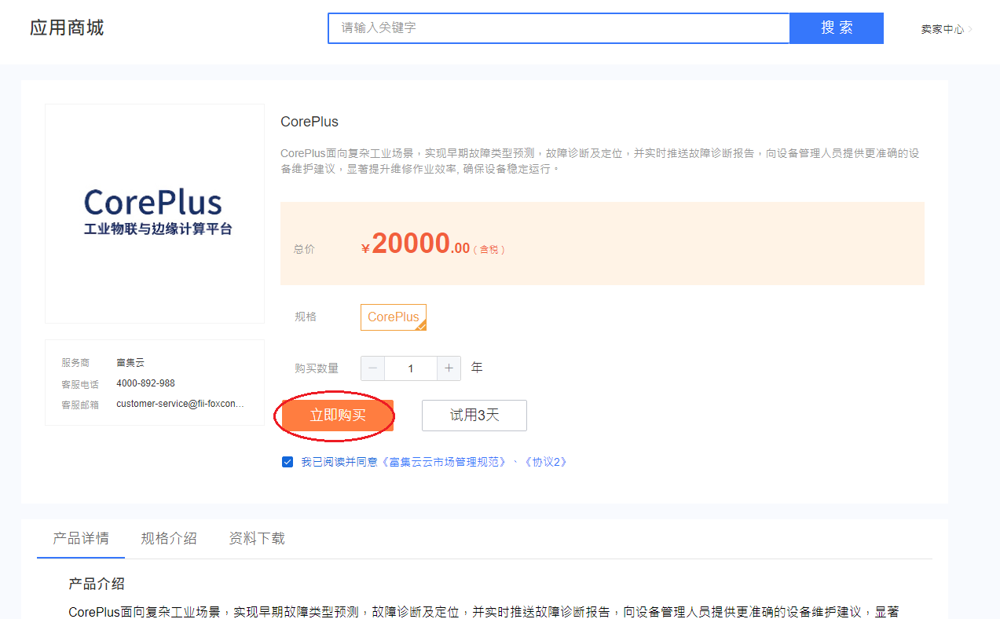
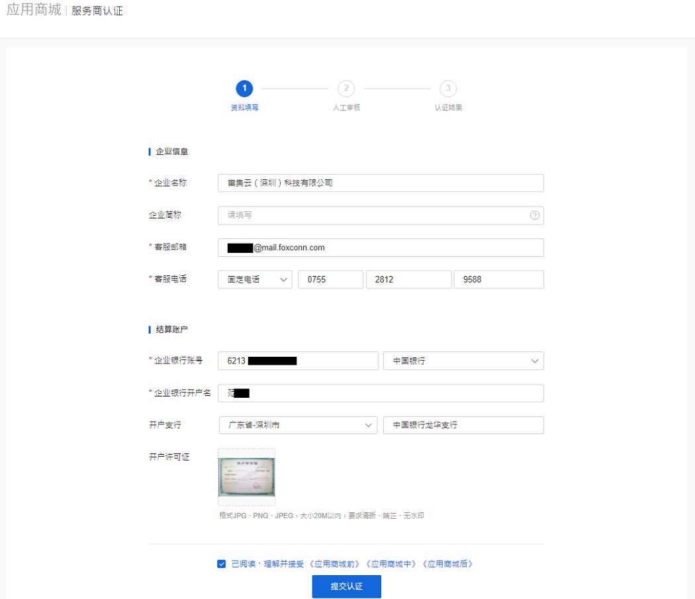

#                                                         富士康工业互联网富集云系统项目
                                                       V0.0.10 20211026
                                                       富集云商城用户手册
# 引言
## 编写目的 
为了帮助用户更好地了解和使用富集云商城，提高用户与富集云商城的亲和度。
##系统介绍
富集云平台是富士康主推的工业互联网平台，企业用户通过该平台可以方便地查找和购买所需的硬件产品、工业应用、咨询服务，通过富集云平台提升企业智能制造水平。本着建平台、用平台、聚生态、促创新，用户也可以将自己开发的优秀产品上架到平台分享给有需要的制造企业，丰富了工业应用，同时也获得了收益。最终富集云平台实现工业应用从上架、购买、使用到管理一整套的解决方案
## 读者对象
所有使用富集云商城的用户。
## 特殊名词定义
无
# 用户
## 用户角色介绍
**富集云商城中涉及的角色有：用户、企业管理员、应用商城服务商、应用商城产品管理员、B2B商城服务商、B2B商城产品管理员、协同商城服务商、协同商城产品管理员、企业用户。用户可以不在任何企业中，也可以多个用户同属于某一个企业，一个企业中的用户会区分为企业管理员、应用商城服务商、应用商城产品管理员、B2B商城服务商、B2B商城产品管理员、协同商城服务商、协同商城产品管理员、企业用户。只有企业管理员才可以申请成为服务商。**  
** 1.用户**  
游客通过点击注册，填写资料，经平台管理员审核通过成为富集云商城的用户。  
** 2.企业管理员**  
用户提交个人认证信息后即可在我的企业界面，申请开通企业，但平台管理员必须先审核个人认证申请后才能审核企业认证，经平台管理员审核通过，企业开通成功，用户成为企业管理员。  
** 3.应用商城、B2B商城、协同制造商城服务商,应用商城、B2B商城、协同制造商城产品管理员**  
企业用户可创建企业，成为企业管理员可入驻成为应用商城、B2B商城、协同制造商城服务商，个人用户可通过企业邀请加入企业后，由企业管理员授权为商城服务商或商城产品管理员  
** 4.企业用户**  
企业管理员可以在企业通讯录界面，通过发送邀请短信邀请用户加入自己的企业，被邀请的用户注册或者登录后成为企业用户。  

## 用户账号指南
### 用户注册
 1.在浏览器的地址栏中输入富集云商城访问地址：https://www.fii-fmc.com 打开富集云商城，点击页面右上角的【免费注册】按钮，如下图所示：  

 2.进入注册页面，按照输入框中提示输入正确信息，说明如下：  
（1）输入有效的手机号码，点击获取验证码（如果手机号码输入错误，手机将收不到验证码短信）；  
（2）收到验证码短信后输入正确的验证码，如果输入错误，需要重新输入或一分钟之后再次获取验证码；  
（3）设置登录密码并再次输入登录密码进行确认；  
（4）查看《富集云服务条款》和《隐私政策声明》。  

 3.此时注册完成，页面会出现【返回首页】及【立即认证】两个跳转入口：  

（1）注册用户可以通过点击【立即认证】进入用户中心完善个人信息及个人实名认证，如下图所示。  

（2）注册用户可以通过点击【返回首页】即可成功登录富集云商城。如下图所示：  

### 用户登录
1.注册用户可以通过点击注册成功提示页面右上角【返回首页】即可成功登录富集云商城。  
2.也可以在浏览器的地址栏中输入富集云商城访问地址：https://www.fii-fmc.com 打开富集云商城。点击页面右侧按钮【登录】，如下图所示：

3.页面跳转到登录页面，富集云商城目前支持账号、手机号2种登录方式。
（1）账号登录：输入已经在富集云商城上注册的手机号对应的用户名（手机或邮箱）、密码和滑动验证，点击登录即可登录到富集云商城，如下图所示：

（2）手机号登录：输入已经在富集云商城上注册的手机号，获取验证码正确填入后，点击登录即可登录到富集云商城，如下图所示：

4.登录后直接进入首页，如下图所示：

### 找回密码
1.用户可在账号登录页面，点击【忘记密码】，进行找回密码的操作，如下图所示：  

2.跳转到找回密码页面，用户输入注册手机号码或邮箱，判断是否为平台的真实用户，滑动验证，点击【获取验证码】，平台会下发验证码到手机号码或邮箱。如下图所示：  

3.进入重置密码页面，输入新密码和确认密码，点击【下一步】，如下图所示：  

4.密码修改成功，流程结束。跳转到修改成功页面，如下图所示：  

## 用户中心
### 个人信息
1.登录后，点击页面右上角用户头像下面的【用户中心】按钮，如下图所示：  

2.用户信息页面，显示用户的个人资料信息：用户名、姓名、手机号码、邮箱、登录密码、安全等级等，如下图所示：  

### 用户实名认证
**用户实名认证之前，必须先修改用户名并且用户名只能修改一次  
修改用户名操作流程：**  
1.在用户信息页面，点击用户名后面的【修改】，如下图所示：  

2.页面出现用户名修改框，按命名要求修改用户名（注意用户名只能更改一次），如下图所示：  

3.输入用户名后，再点击【确认】即会跳转回用户信息页面，可看到用户修改后的用户名，如下图所示：    

**实名认证流程：**  
1.在用户信息页面点击姓名后面的【个人认证】，进入个人认证页面，如下图所示：  

2.用户在个人认证页面输入真实姓名，身份证号码，证件选择、上传身份证人像面和国徽面、手持身份证人像照片，点击【提交认证】，如下图所示：  

3.点击【提交认证】后，将进入人工审核流程，平台管理员将在24小时内审核用户资料，审核通过后即用户实名认证完成。  

4.用户实名认证完成后，在用户信息页面姓名栏位显示的是个人认证时填写的真实姓名，如下图所示：  

### 资料修改
#### 更换头像
**更换头像操作流程：**  
1.在用户信息页面，点击【更换头像】,如下图所示:    

2.在更换图像页面，点击【上传头像】,如下图所示:    

3.可缩放图片，移动选定区域至需要的图像区域，点击【下一步】,如下图所示:    

4.点击【确认】,如下图所示:    

5.图像更换完成,如下图所示:  

#### 修改手机号码
**修改手机号操作流程：
手机验证**  
1.在用户信息页面，点击手机号码后面的【修改】，如下图所示：  

2.进入修改手机号页面，身份验证，滑动验证，再点击【获取验证码】，输入富集云商城下发到用户手机号码的验证码，再点击【下一步】。如下图所示：  

3.绑定电话，用户输入有效的新手机号，再点击【获取验证码】，输入富集云商城下发到用户手机号码的验证码，再点击【下一步】。如下图所示：  

4.修改手机号码成功，如下图所示：  

#### 绑定邮箱
**绑定邮箱操作流程：**  
1.在用户信息页面，点击邮箱后面的【设置】，如下图所示：  

2.页面跳转到身份验证页面，滑动验证，再点击【获取验证码】，输入富集云商城下发到用户手机验证的验证码，再点击【下一步】，如下图所示：  

3.页面跳转到绑定邮箱页面，输入正确的邮箱地址，再点击【获取验证码】，输入富集云商城下发到用户邮箱的验证码，再点击【绑定】，如下图所示：  

4.邮箱绑定成功，如下图所示  

#### 修改登录密码
**修改密码操作流程：**  
1.在用户信息页面，点击登录密码后面的【修改】，如下图所示：  

2.页面跳转到修改登录密码页面，验证方式可选择【手机验证】或【邮箱验证】，下方显示手机号码或邮箱，滑动验证，再点击【获取验证码】，输入富集云平台下发到用户手机或邮箱的正确验证码，再点击【下一步】，如下图所示：  

3.验证码正确，点击【下一步】即跳转到修改登录密码页面，输入新密码、确认密码，点击【更改】如下图所示：  

4.登录密码即已修改成功，可点击【返回用户信息】返回用户中心，如下图所示：  

### 企业信息
#### 企业角色介绍
**企业用户角色共有8种：企业管理员、应用商城服务商、B2B商城服务商、协同制造服务商，应用商城产品管理员、B2B商城产品管理员、协同制造商城产品管理员，企业用户。**  

**1.企业管理员：**最初创建企业的人为企业管理员,只有企业管理员可申请入驻成为富集云的商城服务商，并可邀请个人用户成为企业用户，将企业用户授权为商城的服务商或商城产品管理员。  
**2.应用、B2B、协同服务商，应用、B2B、协同制造商城产品管理：**通过创建企业成为企业管理员后入驻商城后，成为以上角色或被企业邀请加入企业后通过管理员授权成为以上角色  
**3.企业用户：**被企业邀请加入后成为该角色  

**企业角色用户权限一览图：**  

#### 创建企业
**用户创建企业步骤：**  
1.用户可在用户中心点击【企业信息】，点击【添加认证】按钮，如下图所示：  

2.页面跳转到企业认证页面，用户按要求输入企业名称、统一社会信用代码、法定代表人、企业注册地址、企业电话、企业邮箱信息。  

3.填写主营产品、选择行业模式，选择用户角色并上传证件：营业执照、法人身份证等，如用户角色选择的是【法定代表人】，需上传单位证件（营业执照）、法定代表人人像面及国徽面照片。如用户角色选择的是【被授权人】，需上传企业授权书、单位证件（营业执照）、被授权人身份证人像面、被授权人身份证国徽面。再点击【提交认证】，如下图所示：  

4.用户提交企业认证信息后，将进入人工审核流程，平台管理员将在1-3个工作日内审核企业信息，审核通过即企业认证完成。  

5.管理员审核通过后，用户企业信息将会在我的企业页面可见，如下图所示：  

#### 修改企业信息
**用户可在我的企业信息页面，修改企业电话、企业邮箱、主营产品、行业模式、LOGO图片等企业信息。**  
1.用户可点击需要修改的企业信息后面的【 】图标，如下图所示：  

2.企业电话、企业邮箱、主营产品、点击【 】可根据页面提示直接编辑，如下图所示：  

**修改企业电话及企业邮箱**  
1.用户点击企业电话后面的【 】图标，填写新的企业电话后点击【保存】，即可成功修改企业电话，如下图所示：  

2.修改企业邮箱，用户点击企业邮箱后面的【 】图标，填写新的企业邮箱后点击【保存】，即可成功修改企业邮箱，如下图所示：  

#### 通讯录
**邀请用户加入企业**  
只有企业管理员有权限可以通过手机号邀请用户加入自己的企业。  
1.企业管理员在企业信息页面，点击【通讯录】，页面展示所有的企业成员，点击【邀请用户】按钮，输入需要邀请的用户手机号，也可以输入多个邮箱，每个邮箱之间换行，点击【发送邀请】，如下图所示：  

2.被邀请人点击收到的短信链接，进入富集云商城，若有账号，点击页面右上角的【登录】，页面跳转到登录页面， 被邀请人可通过手机号或账号登录到富集云商城，即可加入该企业。若被邀请人没有富集云商城账号，需按照用户注册步骤注册用户账号，注册完登录即可加入该企业，如下图所示：  

3.用户登录富集云商城后在用户中心页面，点击【企业信息】，再点击【填写邀请码】，在企业邀请对话框中输入富集云商城企业管理员下发加入码，点击确认【确认】，如下图所示：  

4.提示已成功加入企业，被邀请用户可在企业信息页面看到该企业的信息，如下图所示：  

5.企业管理员在通讯录页面可看到已加入自己企业的成员信息，如下图所示：  

**删除企业用户**  
企业管理员可删除企业用户，企业其他角色成员没有该权限。  
1.企业管理员点击【用户中心】，点击【企业信息】，进入我的企业页面。  

2.点击【通讯录】，点击操作列的【删除】，如下图所示：  

3.点击【确定】，即可删除用户，如下图所示：  

**设置用户角色**  
企业管理员可把一个企业普通成员设置成富集云应用、协同、B2B商城服务商或商城产品管理员。  
1.企业管理员进入企业信息页面，点击通讯录，点击操作列的【角色】，如下图所示：  

2.弹出角色设置对话框，勾选需要角色权限。点击【确定】，完成用户角色的授权，如下图所示：  

#### 收货地址
**设置收货地址步骤:**  
1.用户进入我的企业页面，点击【收货地址】，如下图所示：  

2.进入添加收货地址页面，用户点击【添加收货地址】，如下图所示：  

3.在弹出的添加收货地址对话框中，填写收货人、手机号码、选择所在区域、详细地址等信息，可勾选设置为默认地址或不勾选，点击【确定】如下图所示：  

4.添加完收货地址后，用户可返回收货地址页面则可看到添加的收货信息，用户还可点击收货地址下方的“编辑及删除”更改或删除收货地址，如下图所示：  

#### 我的平台
**企业管理员可在我的平台中添加第三方应用**  
1.企业管理员在企业信息页面，点击【我的平台】，如下图所示：  

2.点击【新增平台】，如下图所示：  

3.输入需要添加的第三方应用的平台名称及回调地址，点击【保存】，如下图所示：  

4. 第三方应用添加成功，即可看到系统自动生成的APPid及Scretkey信息，如下图所示：  

a，需要查看完整是Scretkey【 】图标，根据系统提示输入登录密码验证，即可查看如下图所示：  

#### 交易密码
**用户重置交易密码步骤:**  
**在富集云商城中只有企业管理员才可以重置交易密码，其他企业角色成员没有该权限。**  
1.企业管理员在企业信息页面，点击【交易密码】，验证方式可选择手机验证或邮箱验证，滑块验证、再点击【获取验证码】，输入富集云商城下发到用户选择的手机或邮箱验证的验证码，再点击【下一步】，如下图所示：  

2.设置新的交易密码，点击【更改】，如下图所示：  

3.跳入设置密码成功页面，如下图所示:  

## 费用中心
### 订单管理
1.登录平台，点击用户头像下方的【费用中心】，如下图所示：  

2.进入订单管理页面，显示当前登录账户的所有历史订单，如下图所示：  

**搜索订单**  
1.页面默认显示所有的订单，可选择订单状态、订单类型，时间范围、商品名称或订单号，点击【搜索】按钮，列表展示符合搜索条件的订单，如下图所示：  

#### 上传凭证  
1.在订单管理中选择需要上传凭证的订单， 点击操作列的【上传凭证】，如下图所示：  

1.弹出上传凭证对话框，输入汇款户名、汇款银行、汇款账号、汇款金额，选择汇款时间，上传凭证，如下图所示：  

2.点击【保存】，上传凭证成功。平台管理员确认收款之后，该订单状态变成待交付，等待服务商交付，如下图所示：  

#### 去验收：
1.服务商交付后，该订单状态变成去验收，用户点击【去验收】，滑动验证、再点击【确认】，如下图所示：  

2.该订单已验收完成，如下图所示：  

#### 取消订单
1.选择一个待付款订单，在操作列点击【取消】。如下图所示：  

2.弹出取消订单对话框，点击【确认】，如下图所示：  

3.该订单状态变成已取消，如下图所示：  

#### 订单详情
1.所有订单均有详情，选择一个订单，在操作列点击【详情】，如下图所示：  

2.跳转到订单详情页面，展示该订单的详细信息，如下图所示：  

## 购买产品
### 购买应用
**只有企业管理员及企业成员中的商城服务商才能购买产品，且企业管理员完成了个人认证和企业认证（创建企业），或企业认证审核中也可以购买产品。未创建企业的普通用户或加入企业的用户购买产品时提示“您不是企业管理员”；若企业管理员没有个人认证，购买产品，提示“请完成个人认证”；若企业管理员没有企业认证，提示“请完成企业认证”。
免费试用产品步骤：**  
1.用户登录富集云商城，点击导航栏【应用商城】，如下图所示：  

2.进入应用商城，可选择产品分类搜索要购买的产品，也可以在搜索框内输入产品名称或关键词进行搜索，如下图所示：  

3.进入产品展示页面，可选择产品分类搜索要购买的产品，也可以在搜索框内输入关键词进行搜索，如下图所示  

4.点击要购买的产品，将进入产品详情页面，如下图所示：  

5.选择要购买规格与数量/单位，勾选我已阅读并同意《富集云云市场管理协议》，再点击【立即购买】如下图所示：  

6.跳转到订单确认页面，用户可点击【提交订单】，如下图所示：  

7.进入支付页面，目前富集云商城仅支持线下汇款，点击【去汇款】，如下图所示：  

8，则需按系统支付页面提示线下汇款到平台指定账号，点击【我知道了】如下图所示：  

9，进入到我的订单页面，可看到购买订单信息，点击【上传汇款凭证】线下汇款到平台指定账号（用户可参考：费用中心-订单管理-上传汇款凭证的步骤完成线下汇款操作），即可完成产品支付，如下图所示：  

# 富集云服务商介绍
**1.富集云商城分别有应用商城服务商、B2B商城服务商，协同制造商城服务商，3个商城，富集云商城中只有企业管理员可以申请服务商认证，且可以同时认证成为多个服务商。其他企业角色用户没有该权限。
**
**2.富集云商城业务范围介绍：**  

**B2B商城服务内容介绍**  
 向工业类产品/设备/原材料的供应商提供商业贸易平台入驻的服务 ，包括企业注册、资料审核、商品上架等。  
 向企业客户提供商品求购发布的服务，以及对应的商品匹配服务，帮助企业解决设备和原物料供应的采购需求，为中小企业打造高效供应链服务的智能采购平台。  
 平台提供统一的订单管理，包括下单、线下支付、开票、售后、退单等服务，使交易在平台上形成闭环，可追溯。  

**应用商城服务内容介绍**  
 向工业类硬件、软件、咨询类供应商提供商业贸易平台入驻的服务 ，包括企业注册、资料审核、商品上架等。  
 平台提供统一的订单管理，包括下单、线下支付、开票、售后、退单等服务，使交易在平台上形成闭环，可追溯。  
 提供贴合工业场景且多样化的工业应用及服务  

**协同制造商城服务内容介绍**  
 向提供人力/运违服务的企业提供入驻的功能，包括企业注册、资料审核、服务上架等。  
 向企业客户提供需求发布的功能，以及对应的运维服务匹配，整合内外部专业领域资源，协助新创的中小企业赋能 。  
 平台提供统一的订单管理，包括下单、线下支付、开票、售后、退单等服务，使交易在平台上形成闭环，可追溯。  

## 服务商入驻
### 应用商城服务商申请
**应用商城服务商申请步骤：**    
1.用户登录富集云企业管理员账号，点击商城首页导航栏【应用商城】，如下图所示：    
  
2.进入应用商城页面，点击右上角【服务商入驻】，如下图所示：    
  
3.进入应用商城入驻介绍页面，再点击【立即加入】按钮，如下图所示：    
  
4.进入服务商认证页面，输入认证信息，其中企业全称、客服邮箱及客服电话已通过用户企业认证时自动录入无需填写，用户需输入企业银行账号、银行开户名、银行名称、银行所在地、开户支行名称、上传银行账号证明，查阅富集云商城规范，确认无误后，点击【提交认证】，如下图所示:    

5.跳转至提交成功页面，等待管理员审核，如下图所示：    
  
6.平台管理员审核通过之后，用户进入应用商城页面，可看到右上角由原来的服务商入驻变为卖家中心，可点击【卖家中心】如下图所示：    
  
7.进入服务商管理页面，点击【我的信息】，可看到注册的公司信息，如下图所示：    
    
修改服务商信息    
用户可在我的信息页面，修改客服电话、客服邮箱信息    
1.用户可点击需要修改的信息后面的【 】图标，如下图所示：      
  
2.企业简称、客服电话、客服邮箱直接编辑修改，点击【保存】即可。如下图所示：      
  

## 产品管理
### 新增产品
1.服务商登录平台，进入服务商管理页面点击左侧菜单栏【产品管理】，如下图所示：  

2.进入产品管理页面，点击左边列表内的【新建】，如下图所示：  

3.进入添加产品页面，编辑产品信息，填写需要上架的产品信息，再点击【保存并下一步】如下图所示：  

4.参数描述：  
a)名称：应用的名称。  
b)分类：共有10个产品分类，可供选择。  
c)产品标签：可选择合适的产品标签，如无合适的产品标签，将需添加的标签提供给商城服务商后台添加后，可使用。  
d)销售单位：可选择合适的产品销售单位，如无合适的产品销售单位，将需添加的产品销售单位提供给商城服务商后台添加后，可使用。  
e) 产品概述：应用的亮点、优势介绍  
f)产品图片: 此图片用于产品的展示  
g)使用指南: 上架商品的使用文档等  
h)产品介绍：产品介绍中包含产品介绍、产品功能。应用场景、其他介绍四部分、服务商可以文字说明及上传图片来介绍产品。  
5. 进入添加产品规格页面，填写规格名称、价格（可选择具体价格或面议），产品描述，点击保【保存】如下图所示： 

6.保存后即可看到添加的产品规格，如下图所示：  

7.如需继续添加产品规格，可点击右上角【新建】，如下图所示：  

8.填写产品规格，点击【保存】，如下图所示：  

9.即可看到新添加的产品规格，如下图所示：  

10.点击规格操作列的【编辑】、【移动】和【删除】可对版本进行修改、移动和删除操作，如下图所示：  

11. 再次点击【产品管理】，进入产品管理页面，即可看到添加的产品信息，如下图所示：  

**产品信息修改：**  
1.选择一个产品，点击操作列的【编辑】，如下图所示：  

2.页面跳转到编辑产品页面，可对产品信息进行修改操作，如下图所示  

3.修改完之后，点击【保存】即可完成产品的修改。  
**产品预览：**  
1.点击操作列的【预览】，如下图所示：  

2.打开一个新的页面，展示该产品的上架后的信息，服务商可检查新增产品的信息，如下图所示：  

3.确认产品信息无误后，即新建产品完成可进行该产品上架流程。  
### 产品上架
**提交审核**  
1.选择一个需要上架的产品，点击操作列的【提交】，如下图所示：  

2.即提交成功，如下图所示：  

3.页面返回产品管理页面，此时的产品状态变为待审核，操作列只有【预览】和【撤回】可点击，如下图所示：  

4.平台管理员审核通过之后，状态变为已通过，如下图所示：  

5.产品上架之后，在应用商城可查看到该产品，如下图所示：  

### 产品下架
产品只有上架（提交）成功之后，操作列才有下架操作。  
**产品下架步骤：**  
1.选择一个需要下架的产品，点击操作列的【下架】，在系统弹出的对话框内点击【确定】，如下图所示:  

2.点击确定之后，产品下架成功，此时产品状态变为未提交，如下图所示：  

### 产品变更
已上架的产品服务商如需要变更产品信息，需先下架产品，才可进行产品信息变更。流程可参考“产品下架”    
1.产品下架后，服务商可点击操作列的【编辑、规格、提交、下架、删除】等功能，对产品信息进行变更，如下图所示：    

2. 产品信息变更后需重新提交审核，重复产品上架步骤即可完成产品信息变更后的上架。    

### 产品删除
**产品删除步骤：**  
1.选择一个产品，点击操作列的【删除】，如下图所示：  

2.弹出提示框确认是否要删除产品，点击【确认】，产品删除成功，如下图所示：  

## 订单管理
### 订单查询
1.任何用户购买服务商上架的产品，在订单列表中都会产生一条订单。服务商点击订单管理进入订单管理页面，在搜索框中输入订单号或用户名筛选订单信息，如下图所示：  

2.交付订单，管理员审核完用户支付凭证后，该订单需要服务商交付，服务商点击操作列【去交付】，如下图所示：  

3.点击【确认】，客户验收完成后即该订单正式完成，如下图所示：  

### 订单详情
1.服务商进入订单管理列表页面，选择一个订单，点击操作列的详情，进入订单详情页。在订单详情页面可看到订单状态、订单号、付款时间，客户信息和购买信息，如下图所示：  

