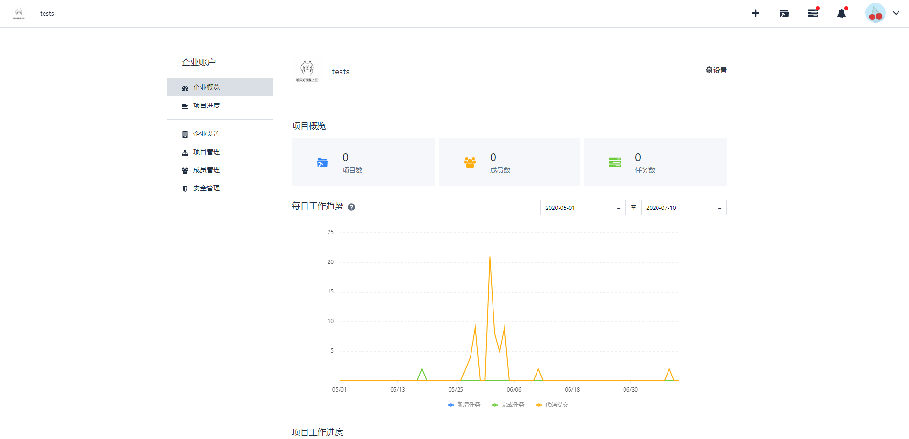
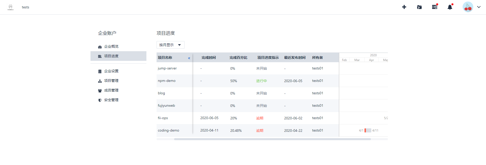
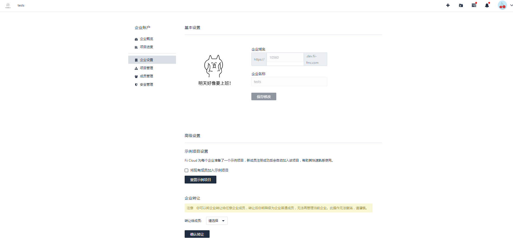

# 企业管理
企业帐户是企业管理用于管理整个企业的控制台，包括：企业概 览、项目进度、企业设置、项目管理、成员管理、安全管理。

## 企业概览

点击左侧导航栏企业概览或者点击右上角的icon、选择企业概览，进入企业概览。可以查看到项目数、成员数、任务数、每日工作趋势、项目工作进度、成员完成任务等数据。

## 项目进度查看

点击项目进度即可看到具体项目的甘特图。可按照周、月季度显示。

## 企业信息修改

点击企业设置进入基本设置页，可修改企业logo、企业名称、企业转让等操作，同时域名已经分配成功且不可修改，设置了演示项目coding-demo,选中将现有成员加入示例项目就能在项目列表页看到成功添加的示例项目。

