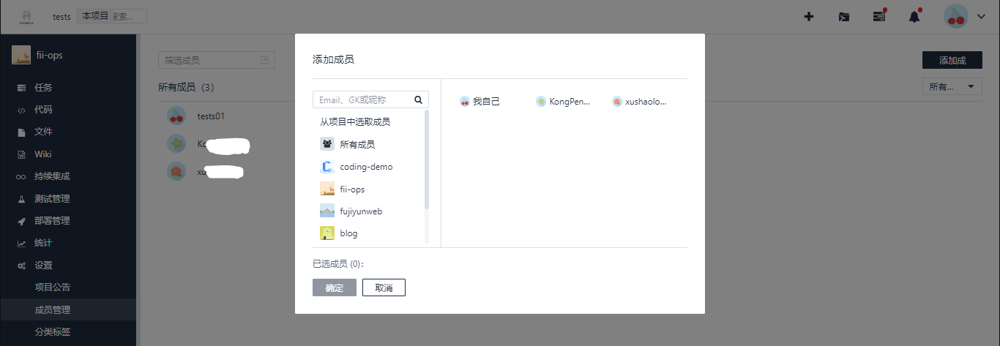
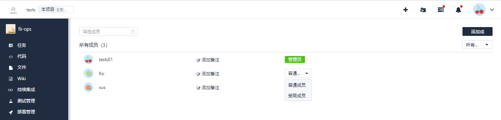

1.添加成员:点击右上角的添加成员可以添加其他项目组的成员进入本项目，具体详见下图:

成员设置有管理员、普通成员、受限成员三种，对应的权限如下:
管理员：可以进行成员管理、项目设置相关操作。
普通成员:除成员管理外均可。
受限成员: 主要是不能查看代码tab下内容，其他权限同普通成员。

------------
**注意:**企业管理员可对项目进行归档、转让、删除等项目级别的危险操作。项目所有者可以设置其他成员为项目管理员、普通成员、受限成员。也可以对该成员进行移除，假如待移除的成员有未完成的任务，需要将这些任务指派给他人后才能彻底移除该成员。

------------

更改组内成员属性如下图所示:

选中该成员的同时右侧会出现红字标记的移除该成员，点击后标志着将从该项目删除成员，当然移除后也是可以重新添加的。

