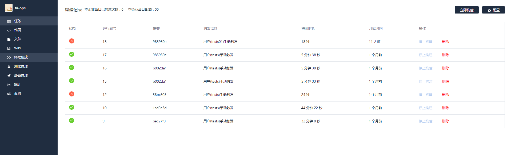
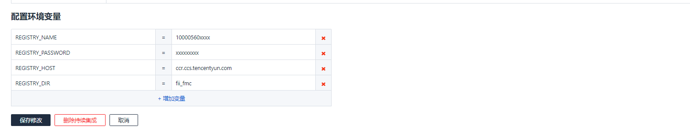
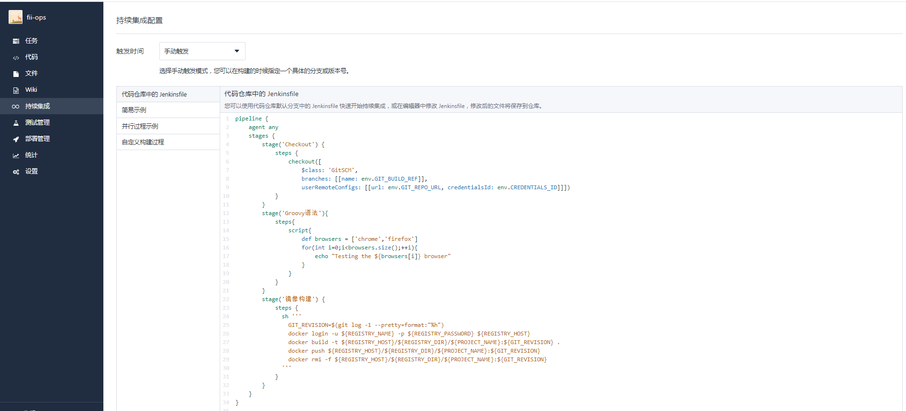
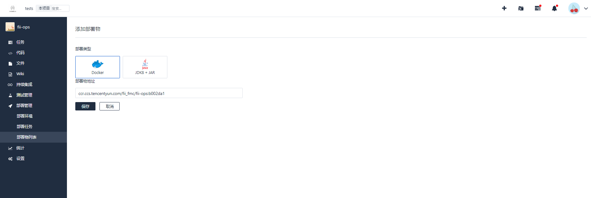
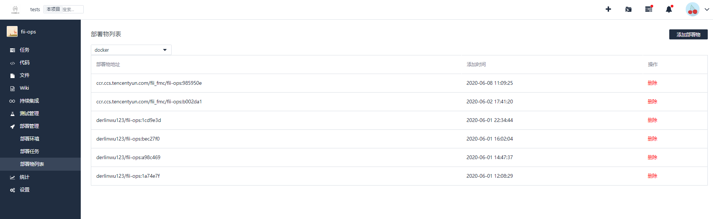
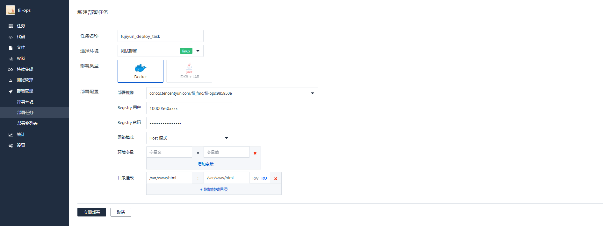
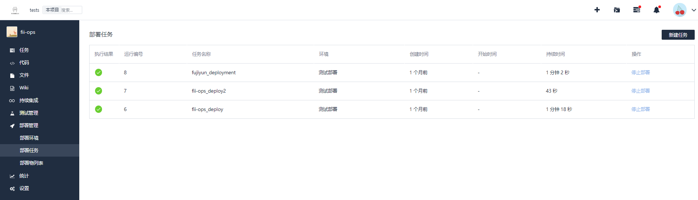
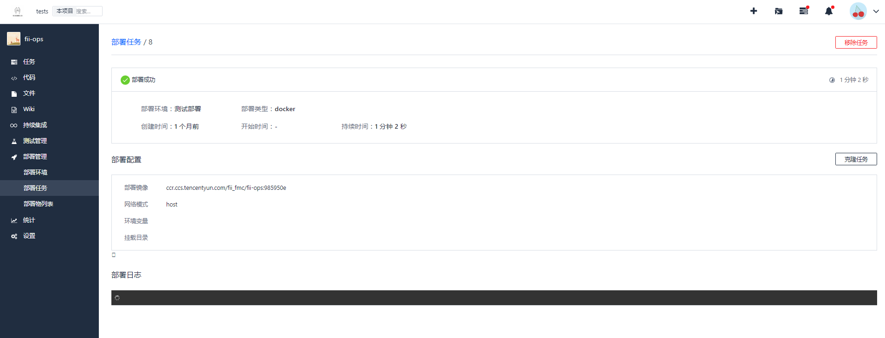

### 什么是持续集成
在软件工程中，持续集成（CI）是指将所有开发者的工作副本每天多次合并到主干的做法。通常每个成员每天至少集成一次，也就意味着每天可能会发生多次集成。每次集成都通过自动化的构建（包括编译，发布，自动化测试）来验证，从而尽早地发现集成错误。持续集成是指开发阶段,对项目进行持续性自动化编译、测试,以达到控制代码质量的手段。持续集成是一种软件开发实践。

持续集成在现代软件研发流程中，扮演了十分重要的角色。通过对每次提交的代码进行自动化的单元测试、代码质量检查、编译构建、接口测试，甚至自动部署，能够大大降低了开发人员的工作负担，减少了许多不必要的重复劳动，持续提升代码质量和开发效率。毫无疑问，持续集成为开发者和开发团队提供统一高效的标准化交付测试流程，大大解放了开发者，使得开发者和团队可以更加专注于产品的开发上面。

理想的状态下，当开发者各自提交分支代码并提交合并请求，相关管理人员执行合并到主分支后，我们希望可以快速、持续地得到直观且有效的反馈。但是软件开发往往涉及不同团队，各团队职责不相同介入时间也不一样，其中可能产生交流成本，影响软件的持续交付，所以一套可自定义的标准集成流程对于敏捷开发尤为重要。

### 持续集成的优势
##### 1. 解放了重复性劳动。
自动化部署工作可以解放集成、测试、部署等重复性劳动，而机器集成的频率明显比手工高很多。

##### 2. 更快地修复问题。
持续集成更早的获取变更，更早的进入测试，更早的发现问题，解决问题的成本显著下降。

##### 3. 更快的交付成果。
更早发现错误减少解决错误所需的工作量。集成服务器在构建环节发现错误可以及时通知开发人员修复。集成服务器在部署环节发现错误可以回退到上一版本，服务器始终有一个可用的版本。

##### 4. 减少手工的错误。
在重复性动作上，人容易犯错，而机器犯错的几率几乎为零。

##### 5. 减少了等待时间。
缩短了从开发、集成、测试、部署各个环节的时间，从而也就缩短了中间可以出现的等待时机。持续集成，意味着开发、集成、测试、部署也得以持续。

##### 6. 更高的产品质量。
集成服务器往往提供代码质量检测等功能，对不规范或有错误的地方会进行标致，也可以设置邮件和短信等进行警告。

### 开发者中心持续集成
然而想在项目和团队中实施持续集成，却不是一件简单的事情。开发者中心持续集成全面兼容 Jenkins 的持续集成服务，支持 Java、Python、NodeJS 等所有主流语言，并且支持 Docker 镜像的构建。借由图形化编排，高配集群多 Job 并行构建全面提速您的构建任务。我们的持续集成服务还支持主流的 Git 代码仓库，包括代码托管、GitHub、GitLab 等等。在构建依赖拉取方面，我们对包括 Maven，NPM 在内的主流镜像源有专用网络优化，保证拉取速度，进一步提升构建的速度。

### 开发者中心“持续集成—部署管理”最佳实践

开发者中心持续集成配置是通过Jenkinsfile脚本完成的。Jenkinsfile定义了持续集成中的pipeline（流水线），实现对步骤的流式化封装和管理，也是持续集成中的基本功能单位。

- 首先，配置持续集成触发条件（时间+方式），触发时间分为代码更新触发，手动触发。触发方式有“推送新标签时触发构建”、“推送到分支时触发构建”以及符合分支或者标签规则时构建（支持正则）

#### 持续集成流程（pipeline）
开发者中心-持续集成模块提供简易通用的流水线实例，支持原生jenkins的pipeline基于插件方式构建集成过程，用户可以根据需求改写jenkinsfile。例如:
```groovy
pipeline {
    agent {
        // 此处设定构建环境，目前可选有
        // java-8,python-2.7,python-3.5,build-essential,ruby-2.3,go-1.7
        label "java-8"
		}
	stages  {
        stage("检出") {
            steps {
                sh 'ci-init'
                checkout(
                  [$class: 'GitSCM', branches: [[name: env.GIT_BUILD_REF]], 
                  userRemoteConfigs: [[url: env.GIT_REPO_URL,credentialsId: env.CREDENTIALS_ID]]]
                )
            }
        }

        stage("构建") {
            steps {
                echo "构建中..."
                // 请在这里放置您项目代码的单元测试调用过程，例如 mvn package
                echo "构建完成."
            }
        }

        stage("测试") {
            steps {
                parallel "单元测试": {
                    echo "单元测试中..."
                    // 请在这里放置您项目代码的单元测试调用过程，例如 mvn test
                    echo "单元测试完成."
                    // 请在这里放置收集单元测试报告的调用过程，JUnit 示例：junit 'target/surefire-reports/*.xml'
                }, "接口测试": {
                    echo "接口测试中..."
                    // 请在这里放置您项目代码的单元测试调用过程，例如 mvn test
                    echo "接口测试完成."
                    // 请在这里放置收集接口测试报告的调用过程，JUnit 示例：junit 'target/surefire-reports/*.xml'
                }
            }
        }
	}
}
```

#### 持续集成列表
持续查看历史集成列表，每一条记录显示集成状态、运行编号、jenkinsfile提交的commitID、集成触发条件信息、持续时长等。点击某一条集成记录查看持续集成详情（构建日志、构建改动记录、测试报告、构建产物等详情）



#### 支持流水线手动配置环境变量。



#### 开发者中心持续集成pipeline详解。

#### 构建环境
- 默认集成六种开发语言构建环境，可选有java-8,python-2.7,python-3.5,build-essential,ruby-2.3,go-1.7
- Docker环境：在指定的 Docker 镜像启动的容器环境中执行 Pipeline 或 stage
- Dockerfile 环境：使用代码仓库中指定的 Dockerfile 脚本构建的容器环境中执行 Pipeline 或 stage

##### 预装的软件 SDK
> 默认环境中提供的 SDK 以及对应的版本如下：
android-sdk: 26.1.1
build-essential
java: 1.8.0_191
python: 2.7.12
python3: 3.5.2
python3.7: 3.7.3
nodejs: 10.15.3
php: 7.3.5
ruby: 2.6.0
go: 1.12.4
dotnet-core: 2.2
erlang: Erlang/OTP 21
elixir: 1.8.1


##### 预装的命令行工具
> 默认环境中提供的命令行工具以及对应的版本如下：
bundler: 1.17.2
cmake: 3.5.1
composer: 1.8.5
coscmd: 1.8.5.36
docker-compose: 1.23.1
docker: 18.09.1
git-lfs: 2.7.2
git: 2.7.4
gradle: 4.10.3
helm: 2.13.1
jq: 1.5-1-a5b5cbe
kubectl: 1.14
maven: 3.6.1
mercurial: 3.7.3
nvm: 0.34.0
pigz: 2.3.1
pip3: 19.0.3
rancher: 2.2.0
rvm: 1.29.7
sshpass: 1.05
svn: 1.9.3
tccli: 3.0.67.1
vsftpd: 3.0.3
yarn: 1.15.2

#### Docker 环境
##### 使用公有 Docker 镜像
参考下面这个例子您就可以从公有镜像仓库中拉取指定版本 SDK 的镜像，作为持续集成的构建环境。
```groovy
pipeline {
    agent {
        docker { 
            image 'node:7-alpine'
            args '-v /etc/hosts:/etc/hosts' //  args 为非必填参数，可以为 docker 执行运行时的参数
        }
    }
    stages {
        stage('Test') {
            steps {
                sh 'node --version'
            }
        }
    }
}
```

##### 使用私有 Docker 镜像
```groovy
pipeline {
    agent {
        docker { 
            image 'laravel-demo/laravel-docker/laravel-demo:1.0.0' // 修改为你的镜像名称
            registryUrl 'https://codes-farm-docker.pkg.coding.net/' // 修改为你的仓库地址
            registryCredentialsId env.CODING_ARTIFACTS_CREDENTIALS_ID // CODING 制品库无需修改此行，其他仓库需录入凭据管理
        }
    }
    stages {
        stage('Test') {
            steps {
                sh 'php -v'
            }
        }
    }
}
```

注意：env.CODING_ARTIFACTS_CREDENTIALS_ID 只可用于本项目的制品库，而跨项目使用制品库需按照下列步骤：
- 在制品库所在的项目中创建「项目令牌」，获得用户名和密码；
- 在持续集成所在的项目中录入「项目凭据」，选择「用户名+密码」类型，并授权给持续集成；
- 在持续集成中添加环境变量 DOCKER_CREDENTIALS_ID，取值选用「项目凭据」，上方的代码也对应改registryCredentialsId env.DOCKER_CREDENTIALS_ID


##### 构建流程（容器方式）
首先源代码根路径下维护项目dockerfilewe文件（同jenkinsfile文件），我们在jenkisnfile直接使用shell命令的方式在jenkins主机上使用docker进行构建流程，构建完成后构建物（镜像）上传至制品库，并删除本地镜像。
- 代码拉取后可进行单元测试、接口测试、质量扫描覆盖率等质量门操作

构建docker镜像并推送至制品库,完整流程如下所示：




#### 部署管理
本系统用户既可以编写持续集成的jenkinsfile进行自定义构建部署，同样可以使用开发者中心提供的“部署管理”模块，创建可视化页面部署流程。

##### 选择部署环境

- 部署环境列表linux主机
- 部署环境-docker server

**注意**：其中使用Docker Daemon部署环境需要在远程docker主机“配置远程访问的API”需要添加配置后重启开通默认2375端口

`vim /etc/docker/daemon.json`
```json
{ "hosts": ["tcp://0.0.0.0:2375", "unix:///var/run/docker.sock"] }
```
`加载配置并重启：systemctl daemon-reload  && systemctl restart docker`

##### 构建物列表
- 首次添加构建物，若首次未构建（或者构建物在远程制品库）需要添加构建物地址


- 若在“持续集成”模块已经成功构建并生成构建物，此处（构建物列表）则自动列出已构建的构建物（镜像、jar包等）


- 新建部署任务


##### 构建任务
- 构建任务的基础基于（1）（2）步骤中的构建环境和已有的构建物创建部署任务，部署项目。


##### 查看部署详情（流程日志）



[首页](http://10.167.6.103:4999/web/#/24?page_id=139 "首页")
[下一页](http://10.167.6.103:4999/web/#/24?page_id=160 "下一页")

[========]
